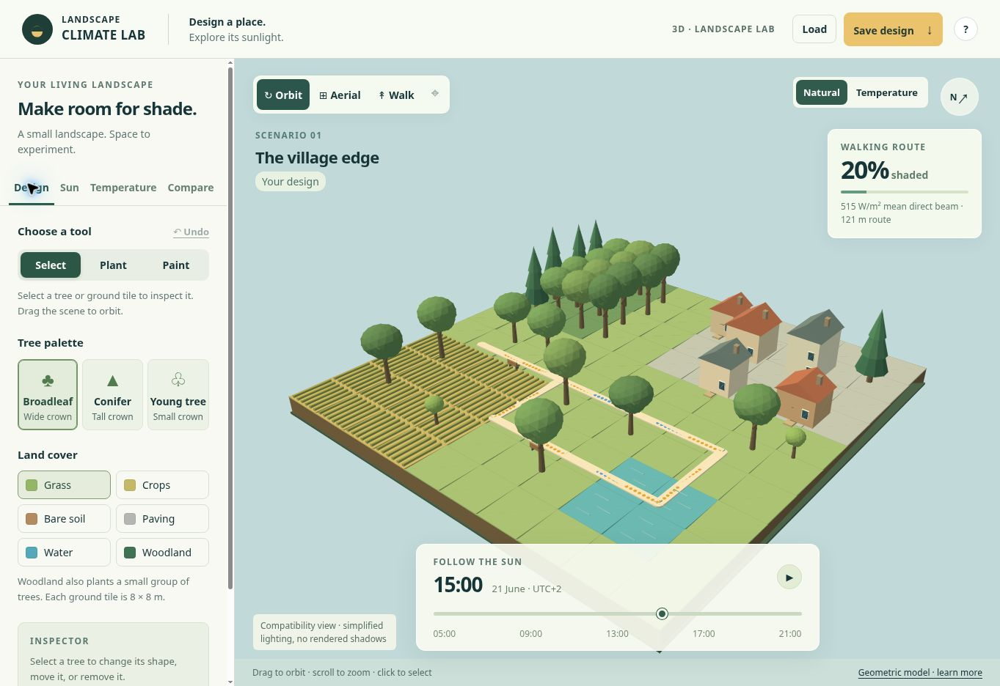
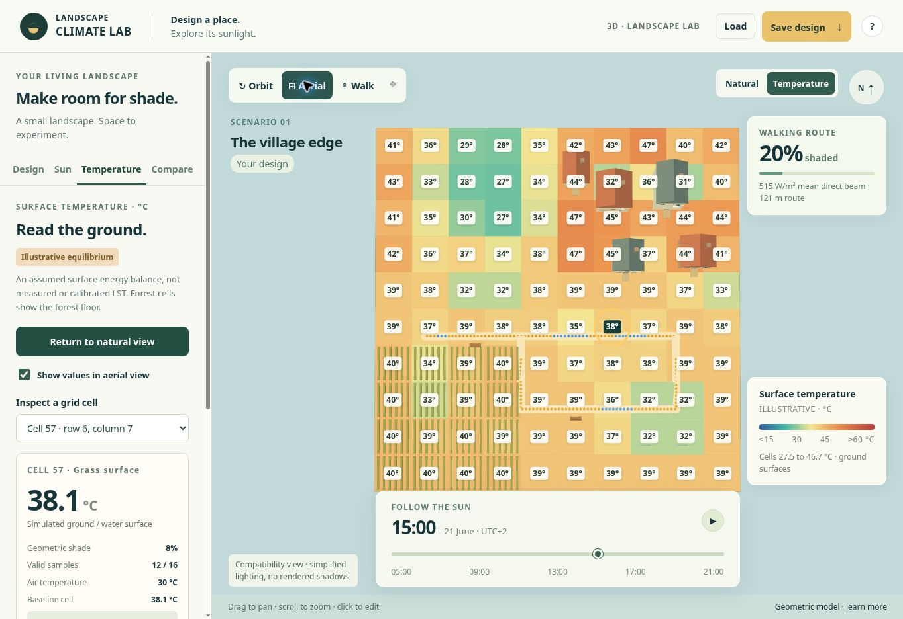

# Landscape Climate Lab

An interactive 3D landscape for exploring how planting, land cover and sunlight affect shade and an **illustrative surface-temperature estimate**. Walk through a village edge, edit trees and ground cells, then compare designs under the same conditions.

Built by **Konlavach Mengsuwan** with AI-assisted implementation. Runs in a browser; Blender is not required.

> **Scientific status:** this is an exploratory demonstration. Temperatures are simulated daytime equilibria using assumed parameters. They are not measured LST, satellite retrievals, or calibrated predictions. Forest cells represent the forest floor, not the canopy.



[Watch the 24-second walkthrough](docs/media/walkthrough.mp4) · [Animated preview](docs/media/walkthrough.gif) · [Model equations and assumptions](docs/MODEL.md)

The media show the actual app's compatibility renderer, which uses simpler lighting and does not draw shadows. Shade measurements and temperature calculations still use the original 3D geometry. The video is a captioned sequence of actual captures, not a continuous screen recording.

## What you can do

| Feature | Explore |
|---|---|
| Three camera views | Orbit, pan from above, or walk at ground level |
| Editable trees | Plant broadleaf, conifer and young-tree forms; move, resize, reshape or remove them |
| Six land covers | Grass, crops, bare soil, paving, water and woodland on a 10 × 10 grid |
| Sun and shade | Change date, time and direct sunlight; inspect route shade and ground exposure |
| Surface temperature | Read a color map, show values over each cell, and click a cell or choose it from a list |
| Weather assumptions | Adjust air temperature, wind, relative humidity and water availability for evaporation |
| Comparisons | Save a baseline and compare it with your design under identical sun and weather settings |
| Saved designs | Export and load JSON files containing both layouts, sun settings and thermal assumptions |



## Try a first experiment

1. Choose **Aerial**, then **Temperature**. Each 8 × 8 m cell has a simulated temperature.
2. Click a ground cell, or use **Inspect a grid cell**. Read its temperature, shade, valid sample count and baseline value.
3. Return to **Natural**, choose a tree form, and plant beside the walking route. Use **Select** to change the tree's height or crown width.
4. Reopen **Temperature** and inspect the affected cells. In **Compare**, switch between your design and the baseline.
5. Change the time and repeat. These are separate equilibrium states; the model does not retain heat from previous hours.
6. Use **Save design** before leaving. Edits otherwise remain only in the current tab.

Tree crowns are hidden in the temperature view to reveal the ground. Their geometry remains in the shade calculation. Buildings and boardwalks are excluded from ground-temperature sampling.

## Run locally

The deployed app needs only a current browser. To serve a downloaded copy on your own computer, choose one of these methods.

### With Python already installed

From the repository folder:

```bash
python -m http.server 8000 --directory dist
```

On systems where Python is named `python3`, use that command instead. Open `http://localhost:8000` in your browser. Stop the server with Ctrl+C.

### For development with Node.js

Use Node.js 22.12 or newer:

```bash
npm ci
npm run dev
```

Open the local address printed by Vite. Production files are already in `dist`; no compilation is required to host them.

The app uses ES modules. Opening `dist/index.html` directly with `file://` is not supported. All runtime libraries are included locally, so a locally served copy does not fetch a CDN, call an AI API, or require an account.

## Controls

| Action | Control |
|---|---|
| Orbit | Left-drag; scroll to zoom; right-drag to pan |
| Aerial | Left-drag to pan; scroll to zoom |
| Walk | W A S D or arrow keys; drag to look; Shift for faster movement |
| Leave walking mode | Escape |
| Plant or paint | Choose a tree/cover, then click the ground |
| Move a tree | Select it, choose **Move tree**, then click its new position |
| Undo | **Undo** restores the last landscape edit, up to 30 edits |
| Inspect temperature | Temperature layer, then click a cell or select it from the list |

The scene supports up to 160 trees. Water removes trees in the painted tile. Woodland adds trees where placement is allowed. Village buildings and the walking route are fixed in this release.

## What the temperature layer represents

The temperature layer solves a simplified surface energy balance using absorbed sunlight, longwave exchange, sensible heat, evaporation and exchange with an assumed lower reservoir. Sunlit and shaded temperatures are solved separately, then averaged using valid sample points.

It uses a single fixed **15–60 °C** color scale for both designs. Temperatures beyond the scale use the end colors; the inspector retains the computed numerical value. Nighttime and unsupported freezing conditions show **no estimate**, rather than zero degrees.

The distinction from observed LST is intentional:

- Ground and water surfaces are represented. Canopy and roof temperatures are not predicted.
- A point-sampled mean is not a sensor-specific radiometric retrieval.
- Surface coefficients and weather are assumed scenarios, not site measurements.
- No heat storage, daily thermal history, wind field, air-cooling feedback or human thermal comfort is simulated.
- Diffuse and incoming longwave radiation are uniform. Canopy obstruction of those fluxes, reflected radiation and canopy longwave emission are omitted.
- Water has no depth-resolved heat storage or mixing, so the app cannot predict nighttime water warming or cooling.

See [MODEL.md](docs/MODEL.md) for equations, constants, every cover preset, numerical limits and sampling details.

## Upload to GitHub

1. Create your repository, for example `landscape-climate-lab`, with your preferred visibility.
2. Upload or push the **contents of this package** to its root, preserving `dist`, `docs`, `tests` and `.github`. The README images use relative paths and must stay with `docs/media`.
3. Review the repository, then add a project license if you want to grant reuse rights. Third-party Three.js files already include their MIT license.
4. To host the app with GitHub Pages, set **Settings → Pages → Source → GitHub Actions**. Then run **Actions → Publish Landscape Climate Lab → Run workflow**.

The included Pages workflow is **manual only**. Uploading the files does not itself trigger publication. The workflow publishes `dist`, without a build step. Use the URL GitHub returns after it finishes. See [GitHub's custom Pages workflow instructions](https://docs.github.com/en/pages/getting-started-with-github-pages/using-custom-workflows-with-github-pages).

The downloadable GitHub package excludes the private Sites project identity, Git history and local dependencies. No GitHub repository has been created by preparing this package.

## Validation

Run the included model checks:

```bash
npm test
```

Seven test groups cover energy-balance closure, response to sunlight/wind/evaporation, sample weighting, night and freezing limits, baseline independence, actual tree raycast effects, legacy/v2 design round trips and valid water/woodland edits.

The compatibility view was exercised in a browser for navigation, per-cell temperature inspection, time/date changes and the nighttime guard. Its screenshots are included here. **The WebGL rendering path was not verified in the capture environment**, which had WebGL disabled. Model checks do not establish environmental predictive accuracy.

## Project structure

| Path | Purpose |
|---|---|
| `dist/index.html`, `dist/style.css` | Responsive interface |
| `dist/app.js` | App state, editing, cameras, sun controls and save/load |
| `dist/model.mjs`, `dist/actions.mjs` | Scene data, sun position, placement and file validation |
| `dist/scene.mjs` | 3D geometry, route and occlusion rays |
| `dist/thermal.mjs` | Energy balance, material assumptions and grid sampling |
| `dist/thermal-ui.mjs` | Temperature layer, cell labels and inspector |
| `dist/compat-renderer.mjs` | SVG fallback for browsers without WebGL |
| `dist/vendor` | Three.js 0.180.0 and its locally bundled add-ons/license |
| `tests` | Reproducible model checks |
| `docs/media` | Actual screenshots and walkthrough media |
| `.github/workflows/pages.yml` | Optional manual GitHub Pages publication |

## Suggested next developments

1. **Import measured LST and surface data.** Add georeferenced UAV or satellite rasters with acquisition time, units, no-data masks and spatial-support information. Show observed and simulated layers separately, then evaluate differences at matching times and footprints.
2. **Add thermal history.** Introduce heat capacity and weather time series before making claims about daily warming, recovery or nighttime water behavior.
3. **Represent canopy properties.** Add crown porosity, leaf area, seasonal foliage, species-informed traits and a distinct canopy energy balance.
4. **Improve planning comparisons.** Add side-by-side views, difference maps, cell time series and exports with complete scenario metadata.
5. **Validate against field observations.** Calibrate on one set of sites and evaluate on independent sites. Report errors and uncertainty before using predictions for research conclusions or design decisions.

These are proposed developments, not current capabilities.

## References and credits

- [NOAA approximate solar equations](https://gml.noaa.gov/grad/solcalc/solareqns.PDF): sun position for the fictional scene at Berlin coordinates.
- [CLM surface-flux documentation](https://escomp.github.io/CTSM/release-clm5.0/tech_note/Fluxes/CLM50_Tech_Note_Fluxes.html): established surface energy-balance concepts.
- [FAO reference-surface methods](https://www.fao.org/4/x0490e/x0490e06.htm): vapor-pressure and surface-resistance concepts. This app is not FAO-56 or CLM.
- [USACE water-temperature simulation](https://www.hec.usace.army.mil/confluence/wqetm/water-quality-transformation-libaries/water-temperature-simulation-module): context for water heat storage and exchange beyond this model.
- [Three.js](https://threejs.org/), including OrbitControls, SVGRenderer and Projector. See [THREE-LICENSE.txt](dist/vendor/THREE-LICENSE.txt).

Project-level reuse licensing has not yet been selected. The screenshots depict the project's own fictional scene, not a measured study site.
